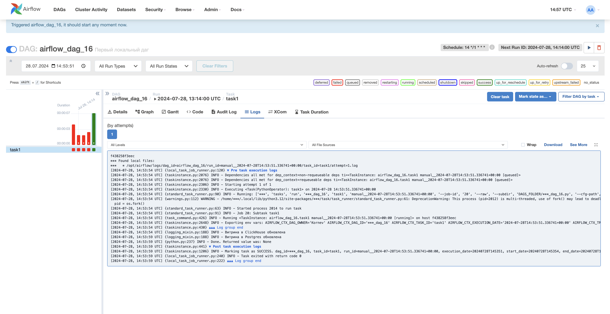
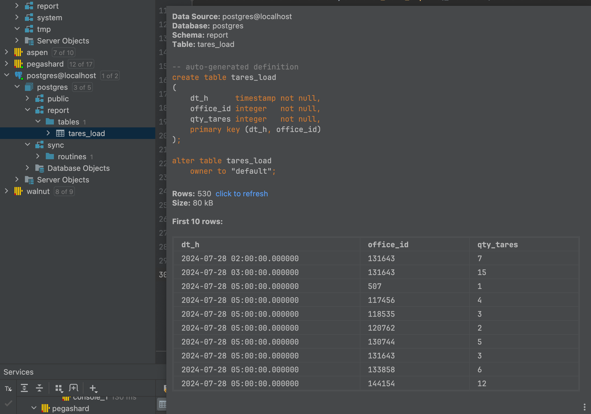

# Задания
### 1. Установить локально Airflow, ClickHouse, Postgres. Не забыть про то, что им нужно общаться, решайте сами, кому как удобно - через ip хоста или через добавления ClickHouse и Postgres в сеть Airflow

Поднимаю [`docker-compose`](./docker/docker-airflow/docker-compose.yaml) файл с помощью команды

`docker-compose up airflow-init`

Затем

`docker-compose up -d`

Поднимаю ClickHouse и Postgress в Docker

[**ClickHouse**](./docker/docker-clickhouse/docker-compose.yml)

`docker-compose up -d`

[**Postgress**](./docker/docker-postgres/docker-compose.yml)

`docker-compose up -d`

Настраиваю сеть контейнера airflow

`docker network connect docker-airflow_default local-postgres`
`docker network connect docker-airflow_default local-clickhouse-server`

Добавляю в контейнеры Airflow пакет clickhouse-driver

`pip install clickhouse-driver`

### 2. Сделать даг, берущий данные из вашего локального ClickHouse, как-то их трансформирующий (не обязательно, но желательно), а затем кладущий в витрину на том же клике (сделать схему reports). После этого даг должен взять данные из только что созданной витрины, преобразовать в датафрейм пандас, и заинсертить их в Postgres по методологии, рассказанной Львом на лекции по Postgres (процедура импорта)

[**airflow_dag_16**](airflow_dag_16.py)

### 3. Скрин, что даг успешно отработал

### 4. Скрин с данными из витрины Postgres

