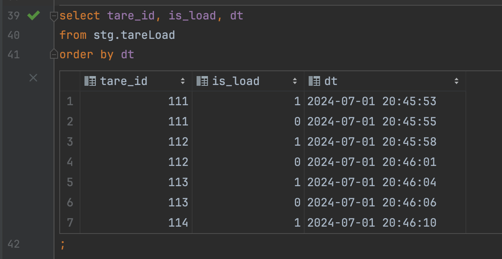
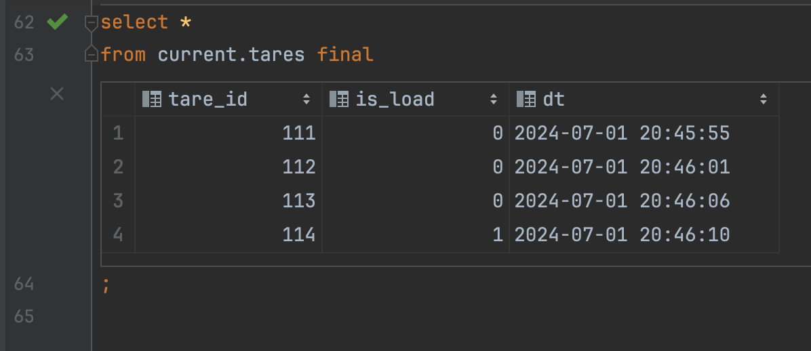

### Поднять кликхаус в докере
`docker run -d --name local-clickhouse-server -p 8123:8123 --ulimit nofile=262144:262144 clickhouse/clickhouse-server`

### Cкриншоты данных в таблице stg и current слоя

> Stage слой

> Current слой

