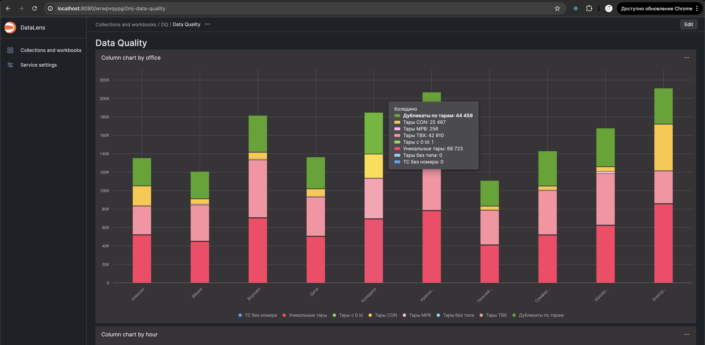
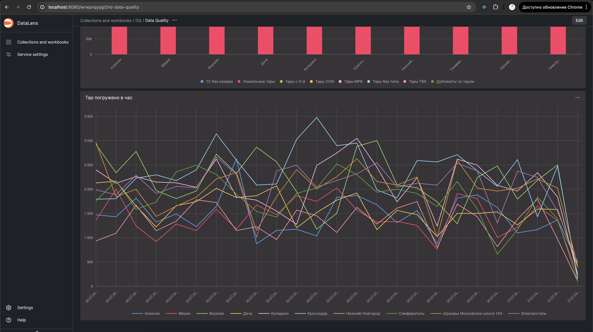
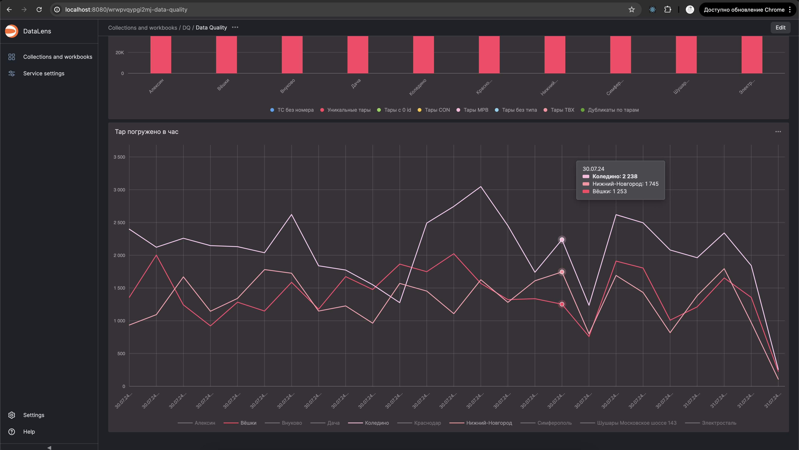

# Задания
### 1. Собрать метрики качества данных по вашей таблице в локальном клике в таблицу


### 2. Поднять DataLens

```
git clone https://github.com/datalens-tech/datalens
cd datalens
docker compose up -d
```

```
cd docker-clickhouse
docker compose up -d
```

### 3. Добавить Clickhouse в сеть DataLens, либо использовать ip-адрес в подключении

```
docker network connect datalens_default local-ch
```

### 4. Отрисовать дашборд с метриками качества данных

[](img/img1.png)
>Дашборд с метриками по офисам

[](img/img2.png)
>Дашборд с кол-вом уникальных погруженных тар по офисам в час

[](img/img3.png)
>Добавил в дашборд фильтр