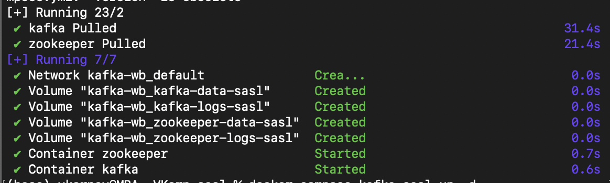
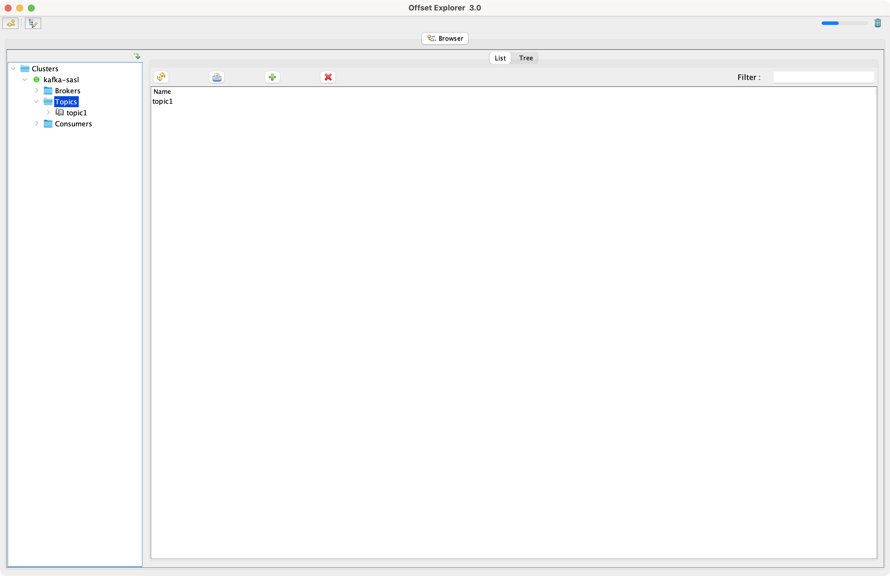
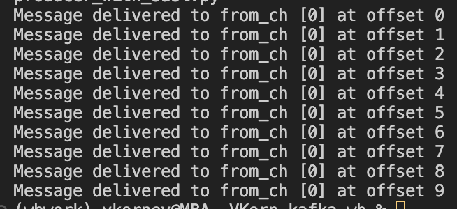
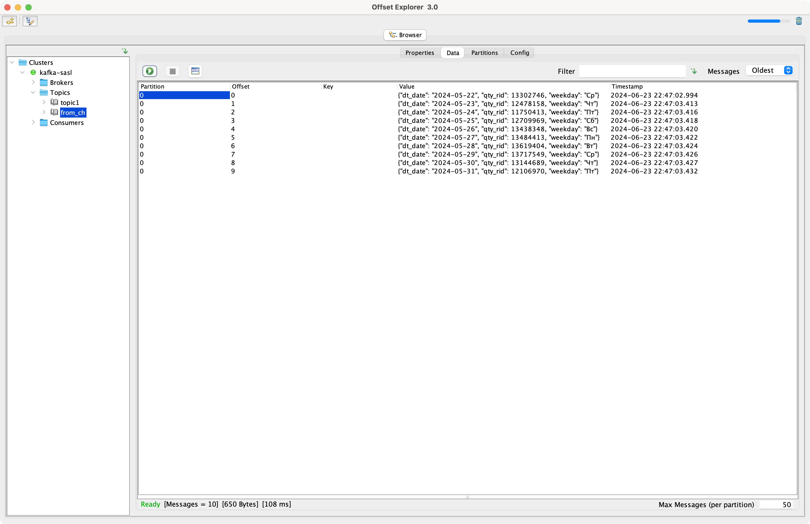
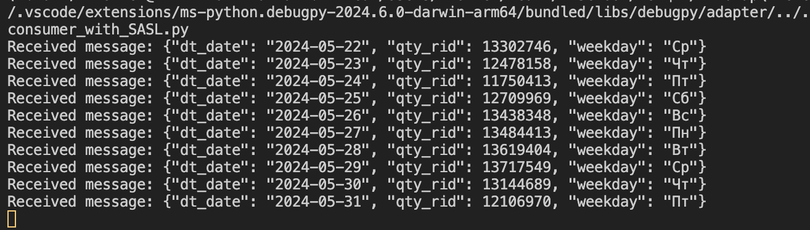

### 1) поднять в docker-compose, из репозитория + sasl 
`docker compose -f docker-compose-kafka-sasl.yml up -d`

### 2) создать топик

### 3) написать python скрипт для заливки данных из небольшой таблицы клика (пегас) в топик кафка в формате json

### 4) программа Offset Explorer, просмотреть данные в топике

### 5) чтение из топика питоном

