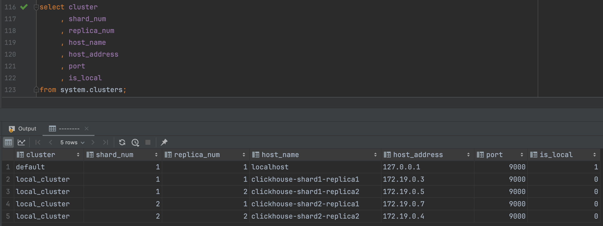
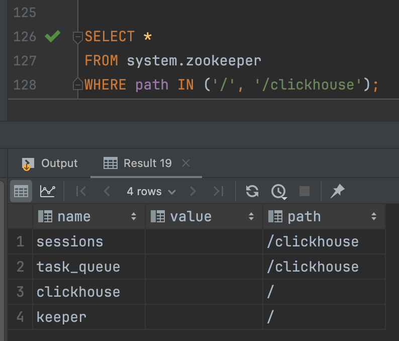
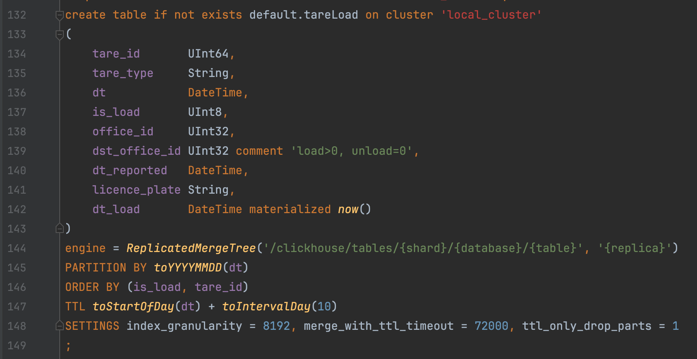
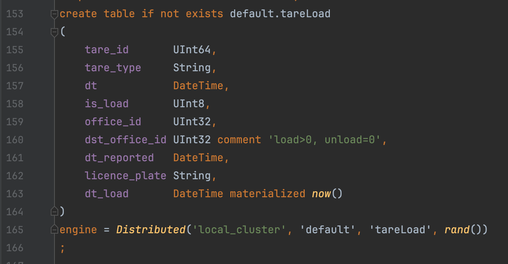
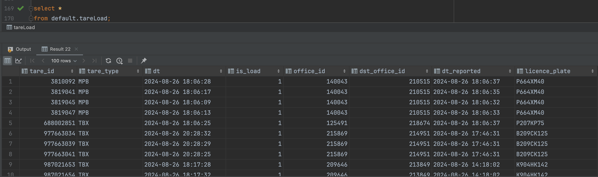
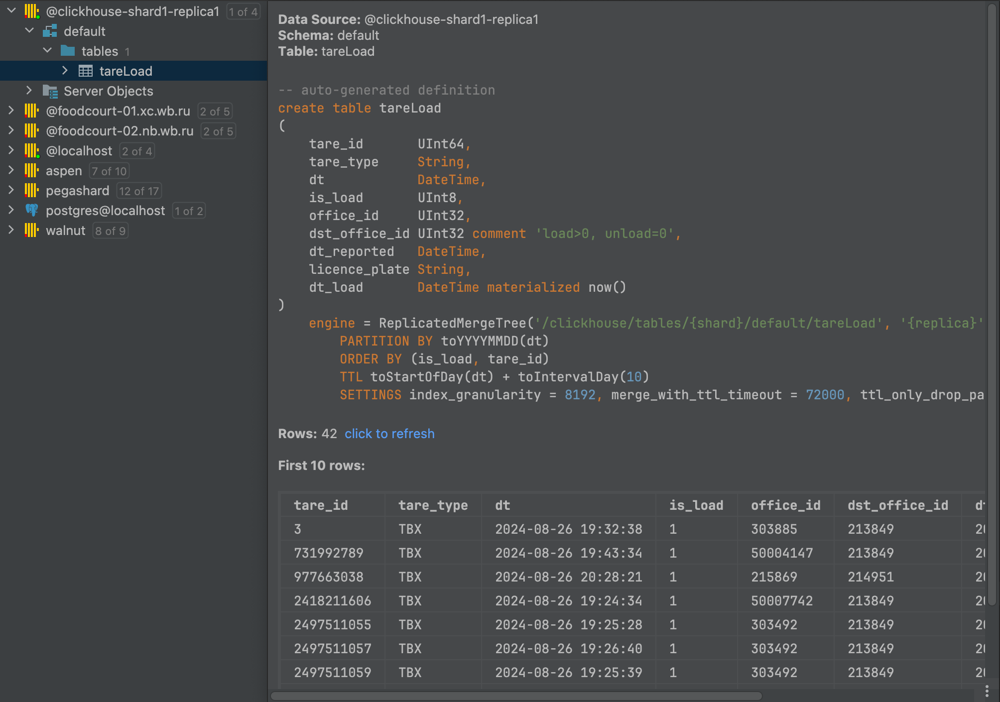

# Cluster clickhouse

Развернуть в docker compose 4х кликов в шардово-реплицируемой схеме. 2 шарда, 2 реплики на каждый шард. 1 clickhouse-keeper. И еще один главный клик на котором будут таблицы distributed указывающие на шардовые таблицы

## Этапы выполнения

### 1) Поднимаем 2 шарда и 2 реплики на каждый шард
- Создаём `docker-compose.yml` файл. Прописываем 4 clickhouse сервиса. Объединяем в 1 network. Пробрасываем пути файлов-конфигураций в директорию `/etc/clickhouse-server/config.d`
- Создаём `custom.xml` файлы-конфигурации для каждой реплики. Сохраняем в `./config/{имя-реплики}/`. В каждом конфиге обращаем внимание на: `listen_host`, описание шардов и реплик в `remote_servers/{cluster_name}/shard`

**Проверка**:

```
clickhouse-client

select * from system.clusters
```
[](img/1.png)

### 2) Поднимаем clickhouse-keeper
- Добавляем в `docker-compose.yml` сервис clickhouse-keeper. Объединяем в 1 сеть. Пробрасываем дефолтный порт. Добавляем файл-конфигурации по пути `/etc/clickhouse-keeper/keeper_config.xml`
- Создаём `keeper_config.xml` файл-конфигурацию для clickhouse-keeper. Сохраняем в `./config/clickhouse-keeper/`. Обращаем внимание на: `listen_host`, настройку внутренних портов в `keeper_server/raft_configuration/server`, настройку внешних портов в `keeper_server/tcp_port` и `keeper_server/server_id`
- В каждый файл-конфигурации каждой реплики добавляем порты для clickhouse-keeper в `zookeeper/node`

**Проверка**:

```
clickhouse-client

select *
from system.zookeeper
where path in ('/', '/clickhouse')

select * from system.zookeeper_connection

echo mntr | nc localhost 9181
```
[](img/2.png)

### 3) Поднимаем main clickhouse server
- Добавляем в `docker-compose.yml` сервис clickhouse-server. Объединяем в 1 сеть. Пробрасываем дефолтные порты. Добавляем файл-конфигурации в директорию `/etc/clickhouse-server/config.d`
- Создаём `custom.xml` файл-конфигурацию. Сохраняем в `./config/clickhouse-main/`. В конфиге обращаем внимание на: `listen_host`, описание шардов и реплик кластера в `remote_servers/{cluster_name}/shard`, порты для clickhouse-keeper в `zookeeper/node`
- В каждый файл-конфигурации каждой реплики добавляем макросы

**Проверка**:

[](img/3.png)

Создание реплицированной таблицы на шардах

[](img/4.png)

Создание распределённой таблицы на мейне

[](img/5.png)

Проверка после insert'a данных в распределённую таблицу

[](img/6.png)

Проверка данных на одном шарде

## Источники
- [ClickHouse Keeper, документация](https://clickhouse.com/docs/en/guides/sre/keeper/clickhouse-keeper)
- [Distributed движок, документация](https://clickhouse.com/docs/ru/engines/table-engines/special/distributed)
- [Масштабирование ClickHouse, хабр](https://habr.com/ru/companies/smi2/articles/317682/)
- [Deploy Clickhouse, WB](https://wh-devops-service.wb.ru/ru/Deploy/Deploy_Clickhouse)
- [ClickHouse Docker Compose, примеры](https://github.com/ClickHouse/examples/blob/main/docker-compose-recipes/README.md)
- [ClickHouse at Scale, youtube](https://youtu.be/vBjCJtw_Ei0?si=REqaILTWRXzxwRjW)