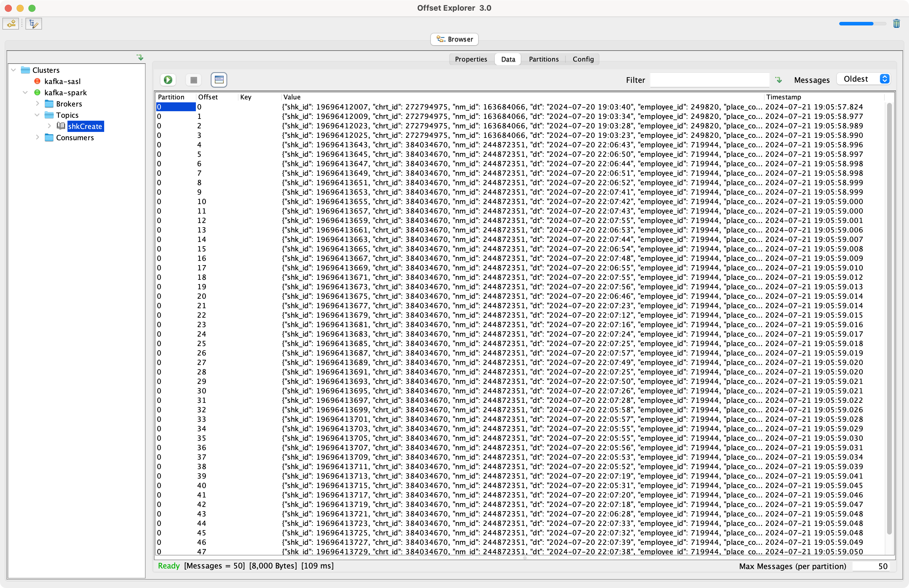
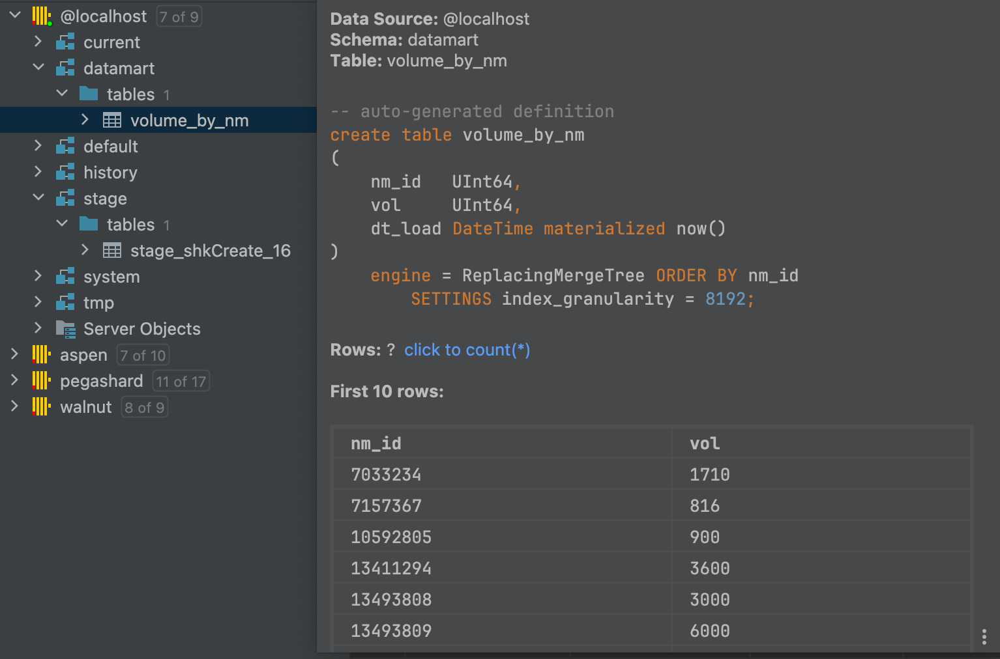
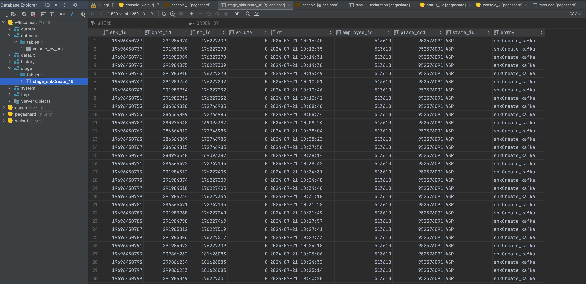
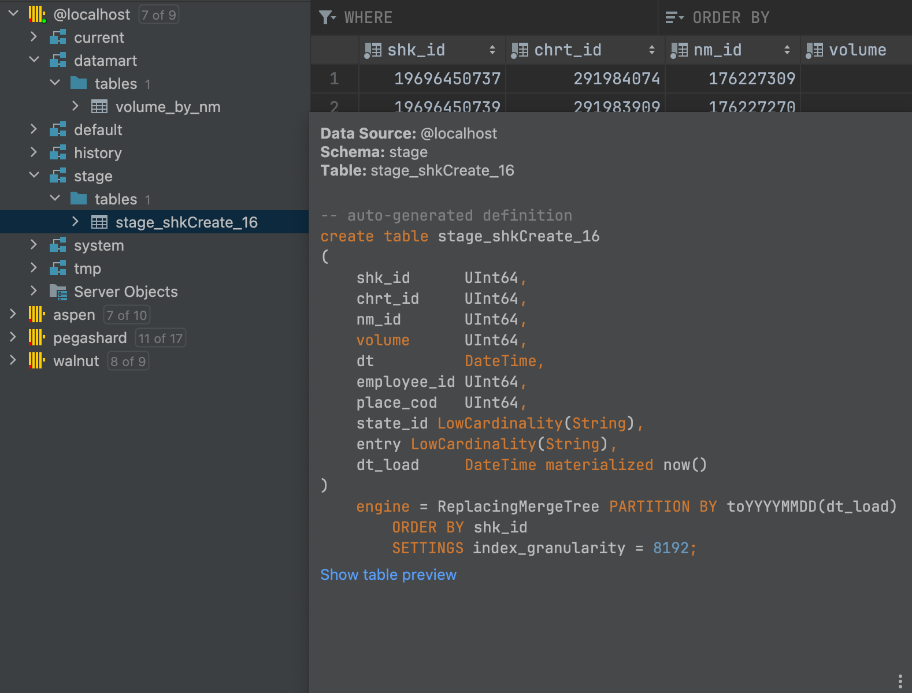
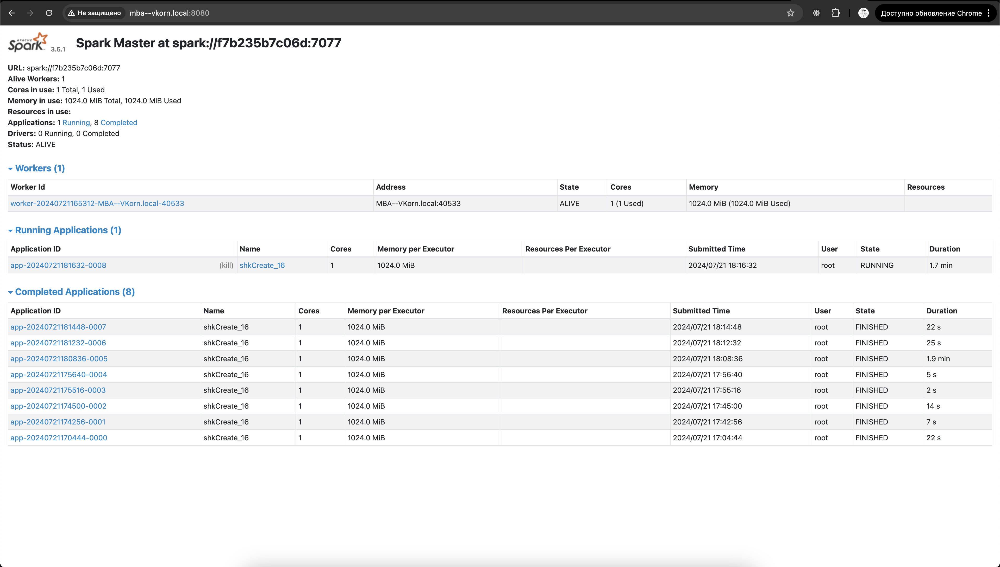
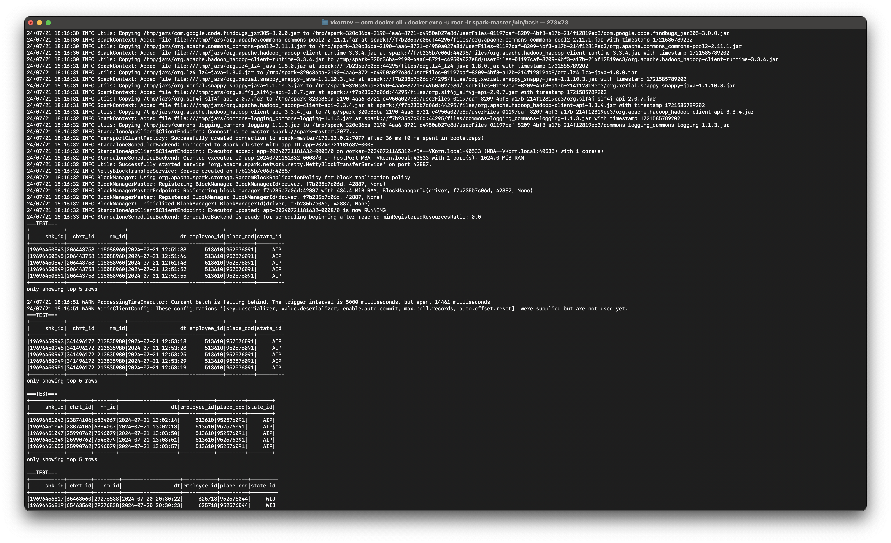
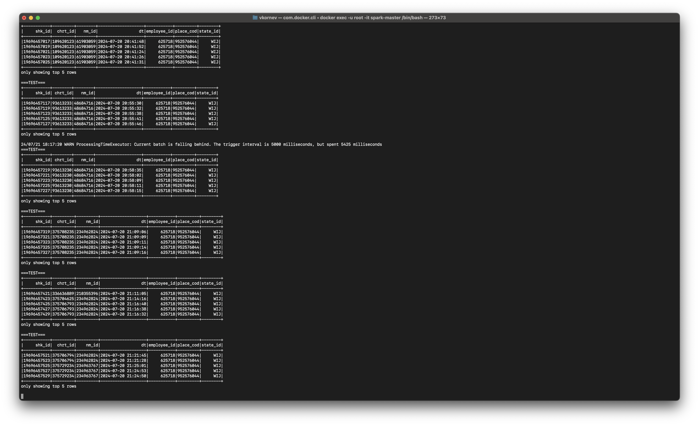

# Структура файлов и папок

## docker-compose
Корневая папка для файлов контейнеров с необходимыми настройками.
Для каждой вложенной папки есть файлы настроек .env_main и .env_reserv с переменными окружения для основного и резервного развертывания. Перед развертыванием контейнеров, нужный файл необходимо переименовать в .env.
В файлах docker-compose могут использоваться внешний volume. Их нужно создавать заранее и давать права на запись службе docker.

## Streams
Корневая папка для заданий spark. Для каждого задания создается отдельная папка.
В каждой папке есть файл с параметрами и python файл самого задания.

```
docker exec -u root -it spark-master /bin/bash

pip install clickhouse_driver clickhouse_cityhash lz4 pandas

spark-submit --master spark://spark-master:7077  \
    --packages org.apache.spark:spark-sql-kafka-0-10_2.12:3.5.0 \
    --executor-cores 1 \
    --conf spark.driver.extraJavaOptions="-Divy.cache.dir=/tmp -Divy.home=/tmp" \
    /opt/spark/Streams/shkCreate_sync.py
```

# Задания
### 1. Считать данные из вашей Кафки через спарк. Если нужно, залейте немного данных с пегас

[](img/img1.png)

### 2. Добавить какую-нибудь колонку. Записать в ваш клик в докере

[](img/img2.png)

### 3. Выложить папку с docker-compose файлами для развертывания контейнеров. Должно быть 2 файла: docker-compose.yml, .env

- [**ClickHouse**](./docker-clickhouse/docker-compose.yml)

- [**Kafka**](./docker-kafka/docker-compose.yaml)

- [**Spark**](./docker-spark/docker-compose.yml)

### 4. Запушить в свой гит получившийся таск спарк

- [**Task Spark**](./Streams/shkCreate_sync.py)

### 5. Выложить в гит скрины с содержимым конечной папки в вашем клике

[](img/img4.png)

### 6. Выложить код структуру конечной таблицы в вашем клике

[](img/img3.png)

### 7. Выложить скрин веб интерфейса вашего спарк

[](img/img5.png)

### 8. Скрин работы вашего приложения из консоли контейнера

[](img/img6.png)


[](img/img7.png)